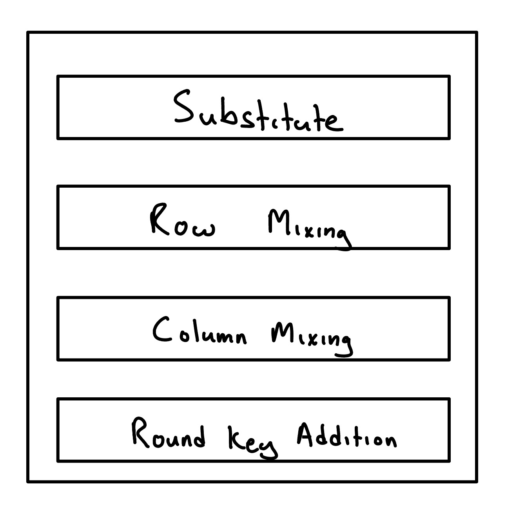
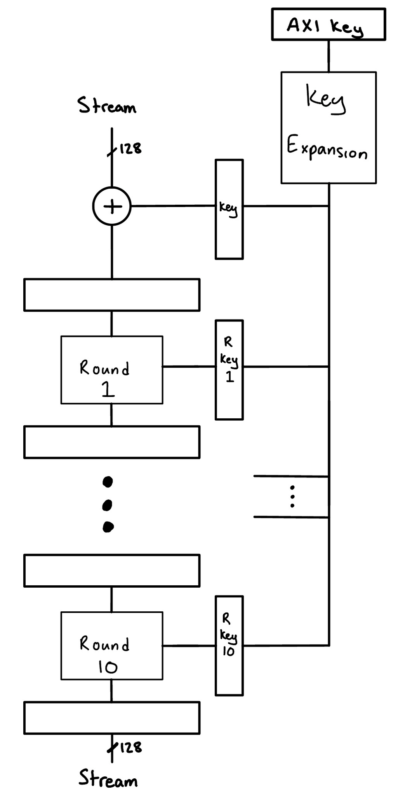
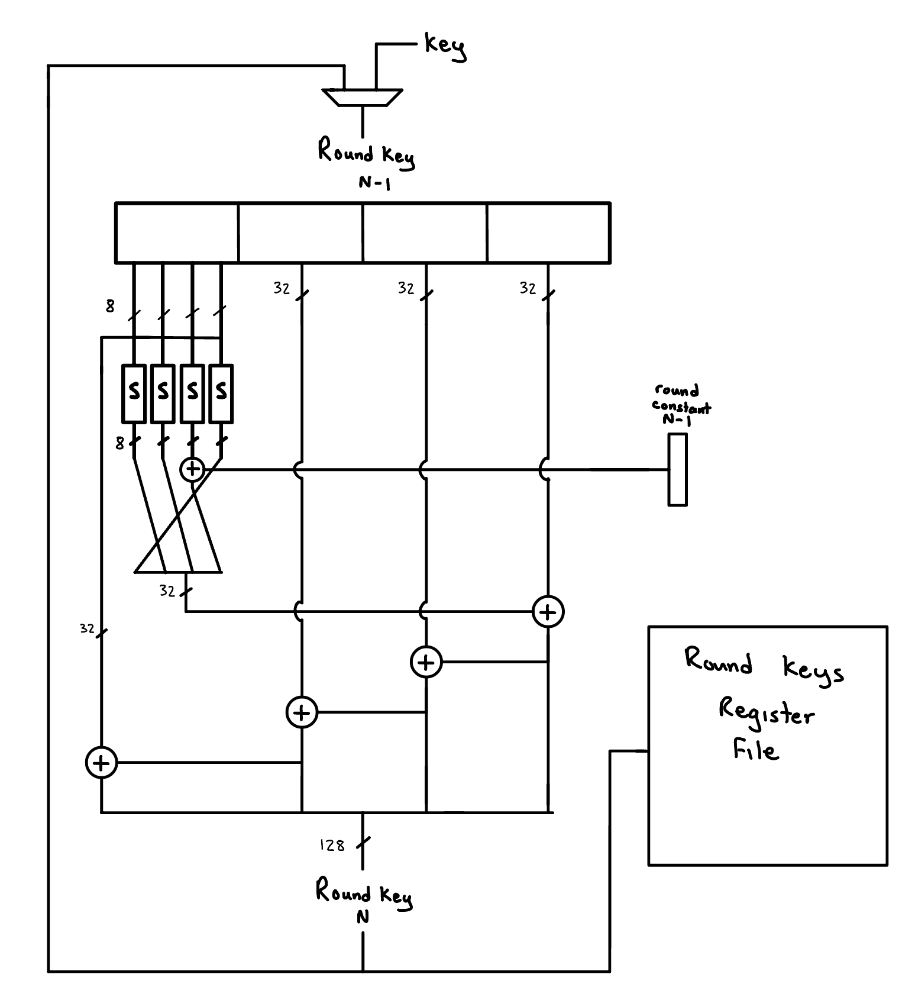
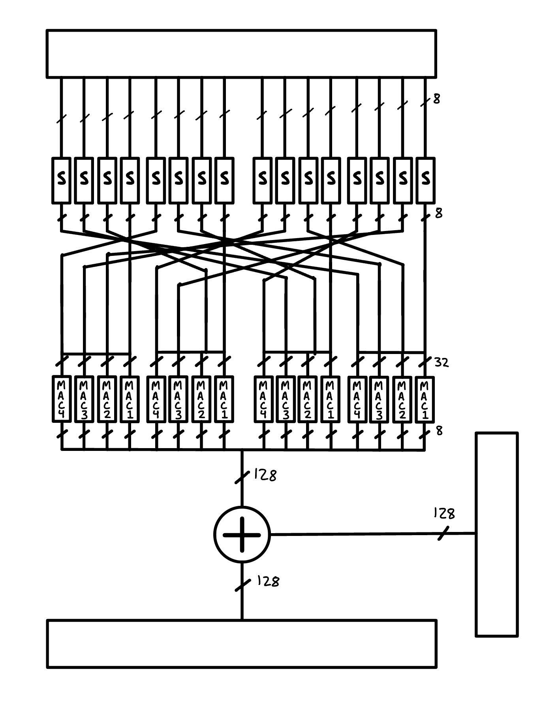
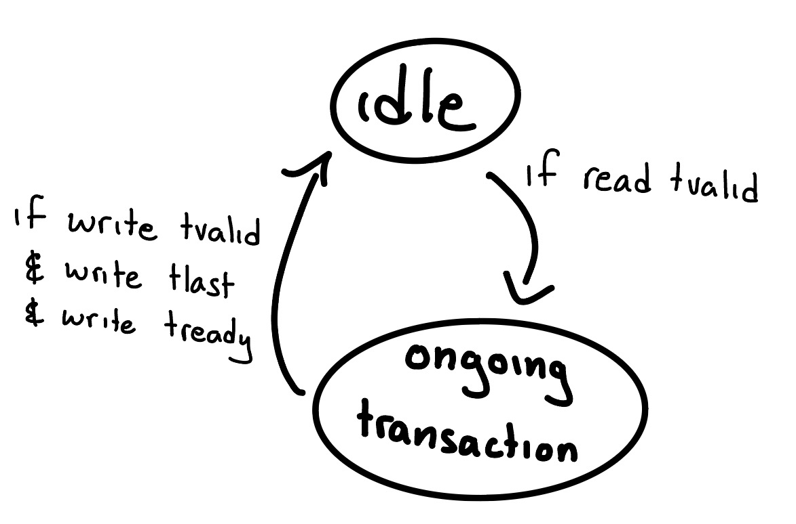
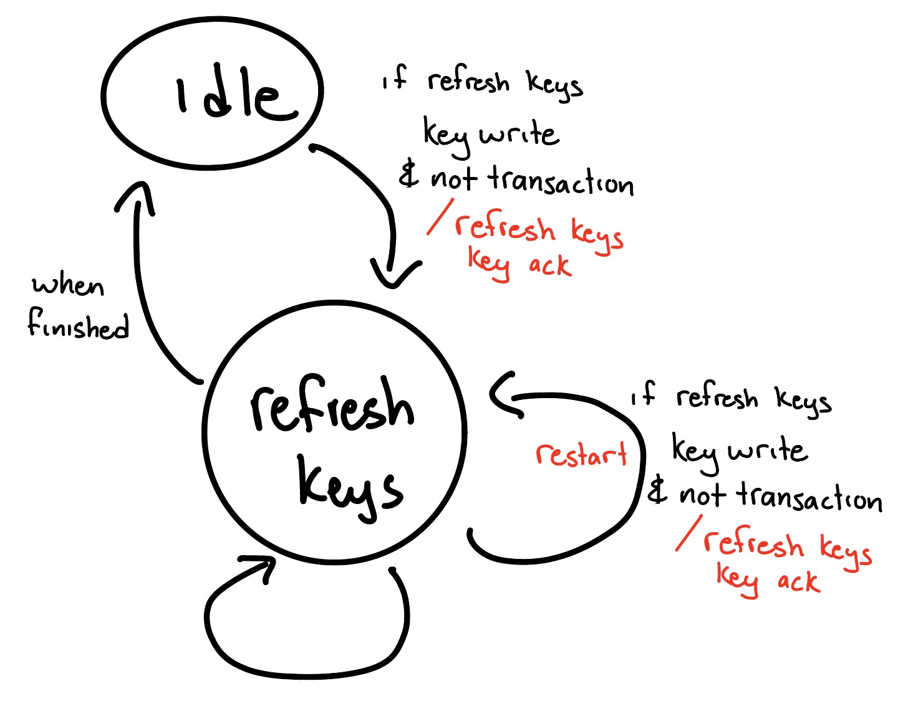
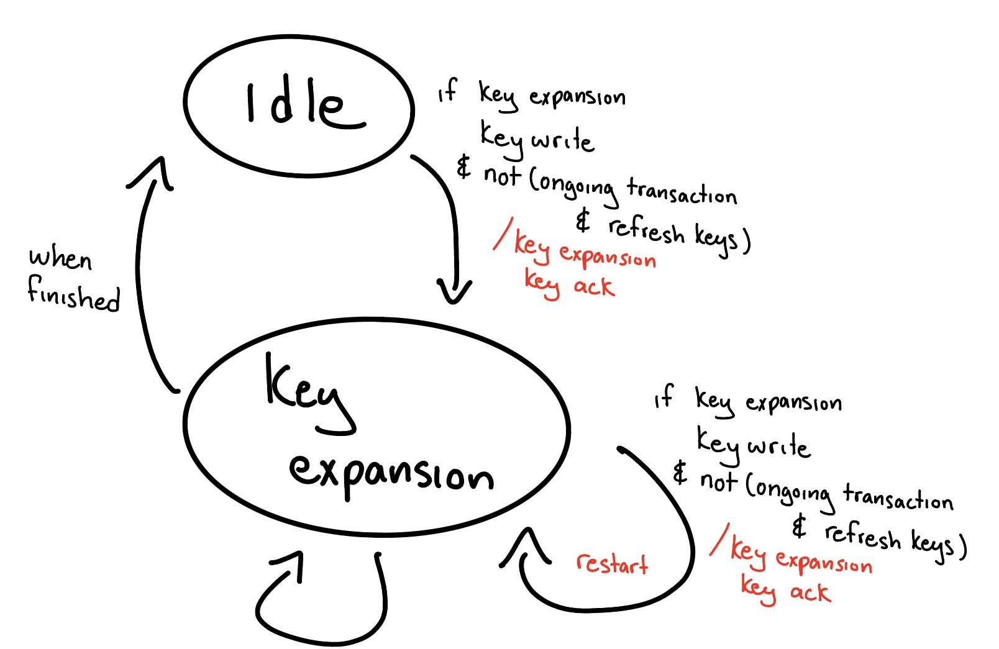
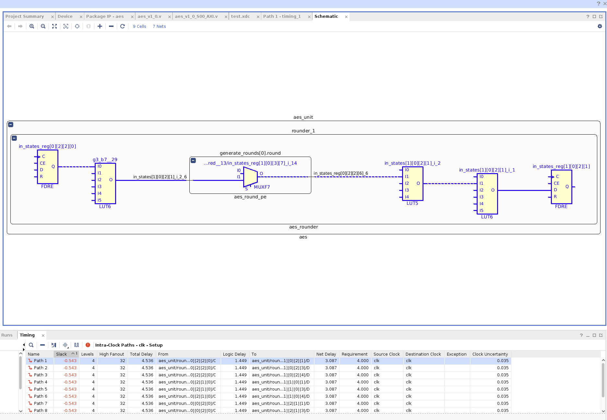
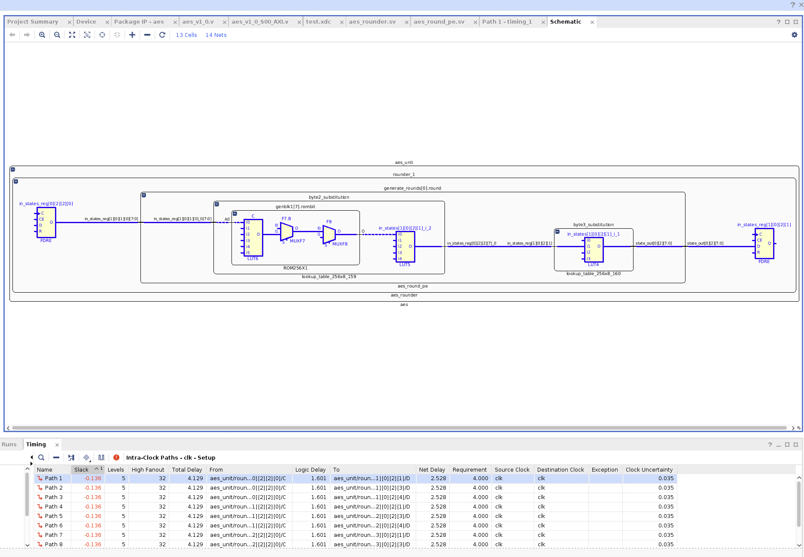
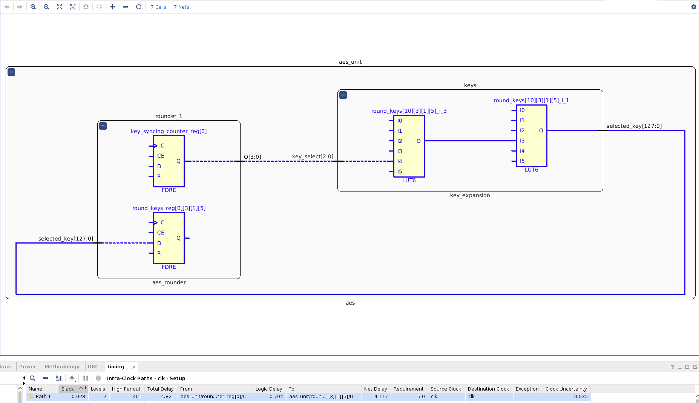

# Background

Advanced Encryption Standard (AES) is a symmetric encryption algorithm.
AES is also more of a group; there is AES-128, AES-192, and AES-256
—where the number refers to the size of the *blocks* in bits. There
are different ways AES can be used to provide security, but the most
primitive usage of AES is AES-ECB (electronic codebook) where blocks of
input are encrypted or decrypted independently with a key. AES-ECB can
be used to implement more fancy usages of AES like AES-GTR and AES-CTR.

AES blocks are typically viewed from the "column-major" perspective.
This means that, for example, we view the second byte of the block to be
at the 1st column and 2nd row.

<figure>
  <table>
    <tr>
      <th>b0</th>
      <th>b4</th>
      <th>b8</th>
      <th>b12</th>
    </tr>
    <tr>
      <th>b1</th>
      <th>b5</th>
      <th>b9</th>
      <th>b13</th>
    </tr>
    <tr>
      <th>b2</th>
      <th>b6</th>
      <th>b10</th>
      <th>b14</th>
    </tr>
    <tr>
      <th>b3</th>
      <th>b7</th>
      <th>b11</th>
      <th>b15</th>
    </tr>
  </table>
  <figcaption>AES Block Column Major Representation</figcaption>
</figure>

# Finite Field $GF(2^8)$

Within the context of AES, math is done over the finite Galois Field
$GF(2^8)$
Without going into too much detail, when we say *add* or *multiply* in
the context of AES, we don't mean the typical adding and multiplying,
but instead how adding and multiplying is defined within the finite
field. For example, an addition in this finite field,
$a+b$, can
be done via
$a \oplus b$
(which is convenient for us from a hardware implementation perspective).

# Algorithm

AES-128 has ten *rounds*. A single block of input, after being added
with the key, needs to propagate through these ten rounds to get to the
output. Each round (except the last —lacking column mixing) contains
four major steps: substitution, row mixing, column mixing, addition.

<figure>

<figcaption>
A Single Round
</figcaption>
</figure>

## Substitution

Bytes are substituted with other bytes with a substitution table. The
substitution table is a constant set of values that doesn't change at
runtime.

## Row Mixing

Bytes within a row are shifted around. The first row in the block is
unaffected while the other rows bytes are rearranged.

## Column Mixing

Column mixing is done with matrix multiplying each column against a
known constant matrix, producing its new column. This is done for any
column, $c$. The final
round skips Column Mixing.

$$
\begin{pmatrix}
b_{c,0} \\
b_{c,1} \\
b_{c,2} \\
b_{c,3}
\end{pmatrix}
=\begin{pmatrix}
2 & 3 & 1 & 1 \\
1 & 2 & 3 & 1 \\
1 & 1 & 2 & 3 \\
3 & 1 & 1 & 2
\end{pmatrix}
\begin{pmatrix}
b_{c,0} \\
b_{c,1} \\
b_{c,2} \\
b_{c,3}
\end{pmatrix}
$$
<figcaption>
Column Mixing Matrix Multiplication
</figcaption>

## Round Key Addition

The related round key to the round is added with to the block producing
the output block for the round. Each round gets a round key from *Key
Expansion*.

## Key Expansion

The round key that is added in the final step of each round is produced
from the Key Expansion. The Key Expansion takes in the key block and
produces 10 more keys for each of the rounds. Key Expansion involves its
own algorithm to produce these derived keys.

# Software Implementation

AES-128 ECB Encryption has been implemented in C from scratch. This
proved useful for debugging and testing my hardware, as well as
understanding the algorithm better. Once this was verified, it was used
to make test cases for the hardware.

# Hardware Implementation

With hardware, we have a few considerations to make: resources, max
frequency, latency, etc. Our AES core pipelines each round, allowing
continuous data to enter and exit while fully utilizing the rounds.

<figure>

<figcaption>
AES Top Level Hardware Design
</figcaption>
</figure>

The Key Expansion is also pipelined as well. We stream data in and
stream data out via AXI Streams. We use a data width of 128 bits so we
can take in a full block at a time. This is similar for the output
stream. Our AES core acts as a AXI peripheral where the key can be
changed via memory mapped registers. We represent the key with the "AXI
Key" register being shown above the Key Expansion block. It should be
noted though that this is actually an abstraction and that there are
actually four memory mapped registers storing the totality of the AES
key. It follows that changes to the key are not atomic, and this is
taken care of in our state management and finite state machines.

## Key Synchronization

The Key Expansion unit houses its own registers storing the round keys
it has computed as well as have a read port to read from those
registers. We utilize a memory read port to reduce congestion in the
FPGA, as opposed to just have eleven massive busses flying out of the
Key Expansion unit. Each round has its own local round key register. As
the pipeline fills up, the local round key registers can be filled up
from the Key Expansion read port. This necessitates that the Key
Expansion key derivation process is at least slightly ahead when the
round units keys are being refreshed. The Key Expansion key derivation
process and the local round key refresh sequence is on a as-needed basis
(we don't refresh or generate round keys when the AXI key hasn't been
written to). One of the benefits of having local round keys is that the
Key Expansion can start working on generating new round keys for a new
key while the current encryption transaction goes on in preparation of a
new transaction.

We can derive the new round key from the last round key and a round
constant that corresponds with the iteration of the round key we are on.

<figure>

<figcaption>
AES Hardware Next Round Key Derivation
</figcaption>
</figure>

## Round

<figure>

<figcaption>
AES Hardware Round
</figcaption>
</figure>

Each round unit is sandwiched between pipeline registers. The S boxes
refer to substitution look up tables. After the substitutions, the bytes
are rearranged, taking care of row mixing, to then be fed into multiply
and accumulate (MAC) units. We have multiple instances of these so to do
them all in parallel. The MACs are used to take care of column mixing.
After this, the block is finally added to the round's respective key.

## State Management

### Transaction Tracking

<figure>

<figcaption>
AES Transaction Tracking FSM
</figcaption>
</figure>

If we are not in a transaction, idle, and we see on the incoming stream
we read from, the *read stream*, that there is valid data, then this
marks that we are starting a transaction. Regardless of wether we can
accept data on that cycle or stalling for whatever reason, we transition
into the transaction state. This is so we can keep track of what the key
means in respect to our transaction. So once a stream transaction
starts, we consider the available key at that time for the transaction
allowing key derivation and local key refreshing to work with each other
appropriately.

We go out of the transaction state once we see that our final output
block is being read.

### Local Key Refreshing

<figure>

<figcaption>
AES Local Key Refresh FSM
</figcaption>
</figure>

Key write is a pending signal relating to when the AXI key registers
have been written to. Key write is asserted until it has been
acknowledged. The refresh keys state updates the local round keys from
the Key Expansion unit. If we haven't been committed to a transaction
and we have a pending key write that needs to be dealt with, we go into
refresh keys state. Because the AXI key is made up of multiple
registers, and so the key update isn't atomic, we may have multiple
sequential key writes. We account for this by being able to restart in
the middle of a refresh keys process instead of being locked to a multi
cycle process before getting to "try again".

### Round Key Derivation

<figure>

<figcaption>
AES Key Expansion FSM
</figcaption>
</figure>

Similar to the Local Key Refreshing FSM, the Round Key Derivation FSM
also has a pending key write signal that is asserted when the AXI key
registers have been written to and de-asserts once acknowledged. If we
have a pending key write, we go into the key expansion state as long as
local key refreshing isn't going on at the same time as a transaction.
If key refreshing isn't going on, but there is a transaction, it's fine
because the local keys have the old version so we can prepare for the
new key and expand keys. If there is no transaction going on, then we
can expand keys fine as there is no commitment. If key refreshing is
happening during a transaction, we can't start key expansion or restart
it as the local keys are trying to sync up with Key Expansion unit. We
are able to restart in the middle of the key derivation process for the
same reasons mentioned in [Key Refreshing FSM](#local-key-refreshing)

## Optimizations

The S boxes ([Found Here](#round))
are each a look up table implemented with ROM intrinsics. This provided
better performance than just inferring the look up tables via something
like:
`
S_BOX[data]
`.

<figure>

<figcaption>
Synthesis Critical Path for AES Unit (Excluding AXI
Peripheral) With Inferred S-Box Look Up Tables
</figcaption>
</figure>

<figure>

<figcaption>
Synthesis Critical Path for AES Unit (Excluding AXI
Peripheral) With S-Box via ROM Intrinsics
</figcaption>
</figure>

Using the ROM Intrinsics, the logic delay of the critical path is worse
but the net delay is better such that the total delay is better. This
isn't Implementation though.

In *Implementation*, the key generation seemed to be critical path. With
switching to to using ROM intrinsics for the S-Box look up table, slack
seems to have reduced from around -0.9 ns to around -0.7 ns.

We changed to computing the round constant look up a cycle before it's
needed. Even though it can be done in parallel during the relevant cycle
without extra logic delay, to have routing come out of a register seems
preferable to having it come out of LUTs.

With lowering our goal frequency to 200 MHz and running
*Implementation*, we see that the most critical path is the
combinatorial read port of the Key Expansion unit:

<figure>

<figcaption>
Implementation Critical Path for AES Unit (Excluding AXI
Peripheral)
</figcaption>
</figure>

Using a non combinatorial read port may require us to have an extra
cycle where the key expansion has to be ahead of the rounder.
Considering that the timing of this critical path is similar to that of
the next most (unique) critical paths, fixing this with adding a
potential extra cycle of latency while just having a different, but
almost same delay, critical path doesn't seem worth it.

## Theoretical Performance

Assuming the pipeline is filled, the operating frequency is 200 MHz, and
that we are streaming in a block and streaming out a block every cycle,
then we have:

$$ 16 \frac{\textup{bytes}}{\textup{cycle}} \times 200 \frac{\textup{M cycles}}{\textup{second}} = 3.2 \textup{ GBps} $$

## AES Hardware Core Testing

Using the Zedboard, the HP memory buses data widths are constricted to a
maximum of 64 bits. This is an issue considering that our AES core takes
in 128 bits at once. For our testing, we use two HP memory ports for the
read and write channels of the DMA (with a 1 to 1 AXI interconnect in
between). This is to reduce the memory bottleneck. The DMA critical path
doesn't support our frequency of 200 MHz so the frequency has been set
to around 142 MHz.

We can test our hardware AES core against a AES software implementation
found online. The software was compiled with -O3. Testing encryption on
a around 14 MB video using both software and our hardware AES core:

<figure>
  <table>
    <tr>
      <th></th>
      <th>Timer Cycles</th>
      <th>Time (seconds)</th>
      <th>Bytes</th>
      <th>Throughput (MBps)</th>
      <th>Throughput (MBps) Including Cache Flushing and Invalidation</th>
    </tr>
    <tr>
      <td>Software</td>
      <td>939762981</td>
      <td>2.819289</td>
      <td>14162363</td>
      <td>5.023</td>
      <td></td>
    </tr>
    <tr>
      <td>Hardware</td>
      <td>4132842</td>
      <td>0.012399</td>
      <td>14162363</td>
      <td>1142.262</td>
      <td>376.393</td>
    </tr>
  </table>
  <figcaption>AES Software vs Using Hardware AES Core on Zedboard</figcaption>
</figure>

The hardware has over 200 times the throughput of the software
implementation.

The 1.142 GBps is consistent with the 3.2 GBps theoretical throughput if
you keep in mind the memory bandwidth is half our assumed theoretical
memory bandwidth.
